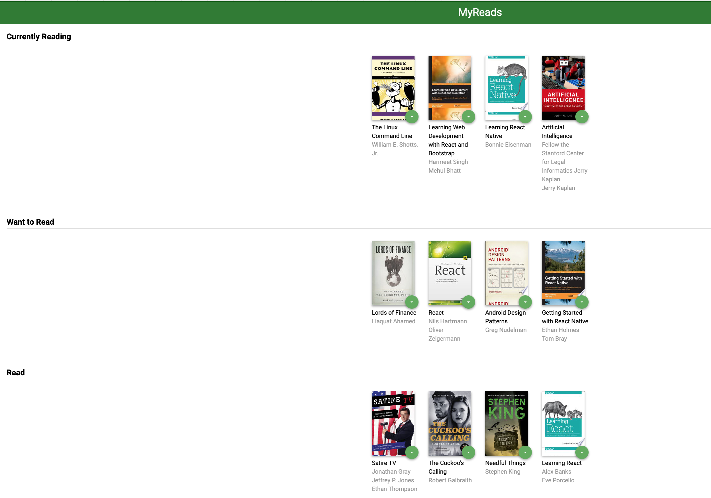
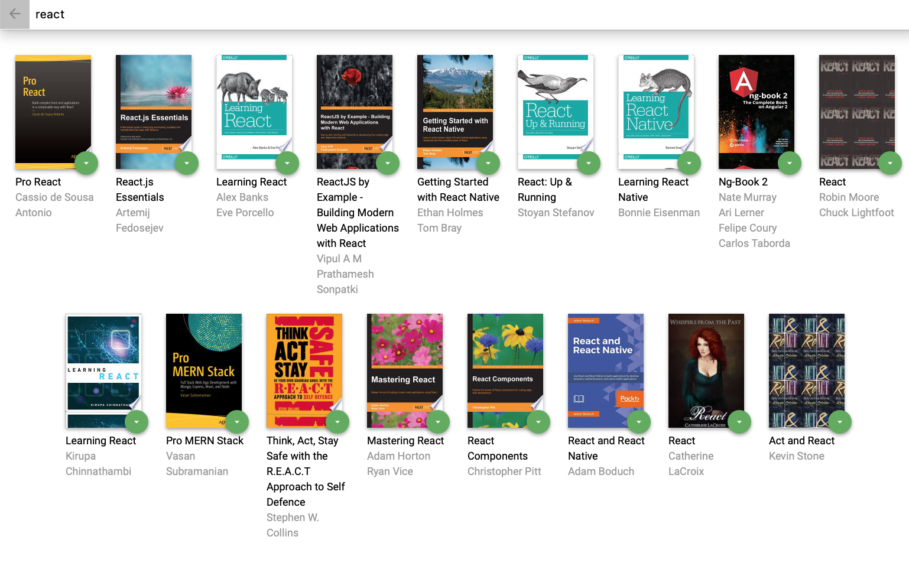
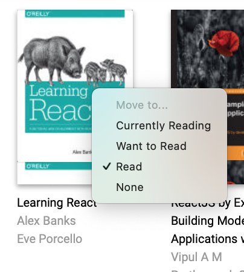
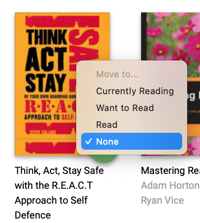

# MyReads Project

This is the project for Udacity's React Fundamentals course.
The MyReads app is a bookshelf app that allows you to select and categorize books you have read, are currently reading, or want to read.
I have used React to build the application.
The starter code provided an API server and client library that I have used to persist information and interact with the application.

The application:

1. Has the main page where user can see books on three shelves:

- currently reading
- want to read
- read


 
2. Has the search page where user can search books by book's name and authors
 

 
3. There is an opportunity to change a bookshelf for each book on both main and search pages. Both pages show the same and correct shelf position of the books. If book isn't on one of three user's shelfs
  the option 'none' is selected in a shelf changer menu.
 

 


## Getting Started

- install all project dependencies with `npm install`
- start the development server with `npm start`

## Backend Server

Udacity provided a backend server. The provided file [`BooksAPI.js`](src/BooksAPI.js) contains the methods you will need to perform necessary operations on the backend:

- [`getAll`](#getall)
- [`update`](#update)
- [`search`](#search)

### `getAll`

Method Signature:

```js
getAll();
```

- Returns a Promise which resolves to a JSON object containing a collection of book objects.
- This collection represents the books currently in the bookshelves in the app.

### `update`

Method Signature:

```js
update(book, shelf);
```

- book: `<Object>` containing at minimum an `id` attribute
- shelf: `<String>` contains one of ["wantToRead", "currentlyReading", "read"]
- Returns a Promise which resolves to a JSON object containing the response data of the POST request

### `search`

Method Signature:

```js
search(query);
```

- query: `<String>`
- Returns a Promise which resolves to a JSON object containing a collection of a maximum of 20 book objects.
- These books do not know which shelf they are on. They are raw results only. ( In the app You can see that books have the correct state while on the search page, it was made in React modules).

## Important

The backend API uses a fixed set of cached search results and is limited to a particular set of search terms, which can be found in [SEARCH_TERMS.md](SEARCH_TERMS.md). That list of terms are the _only_ terms that will work with the backend, so don't be surprised if your searches for Basket Weaving or Bubble Wrap don't come back with any results.

## Authors

Udacity, Kotova Evgeniia
